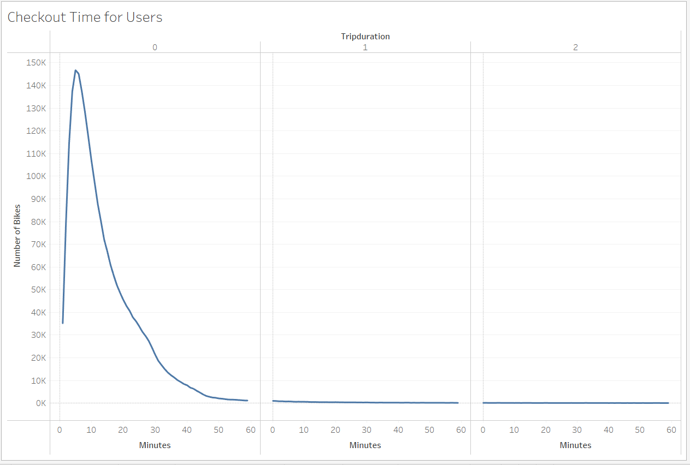
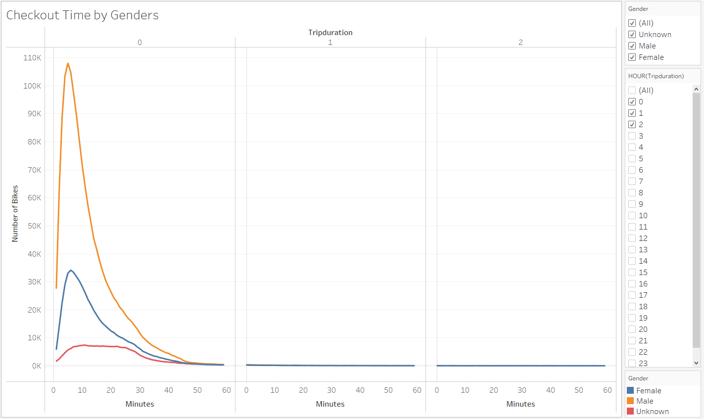
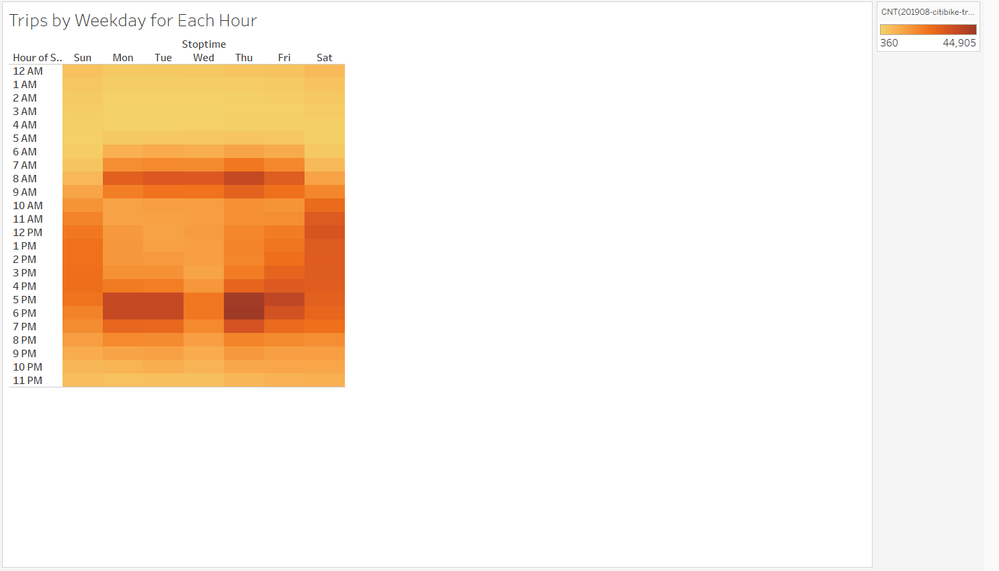
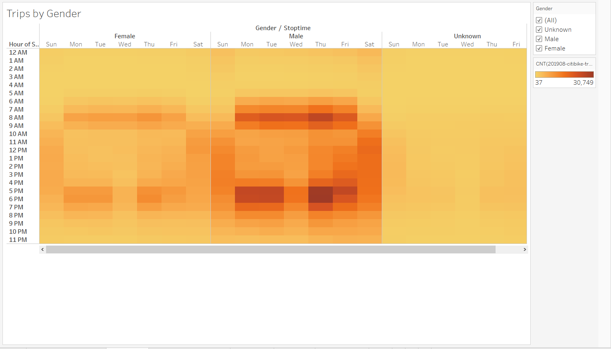
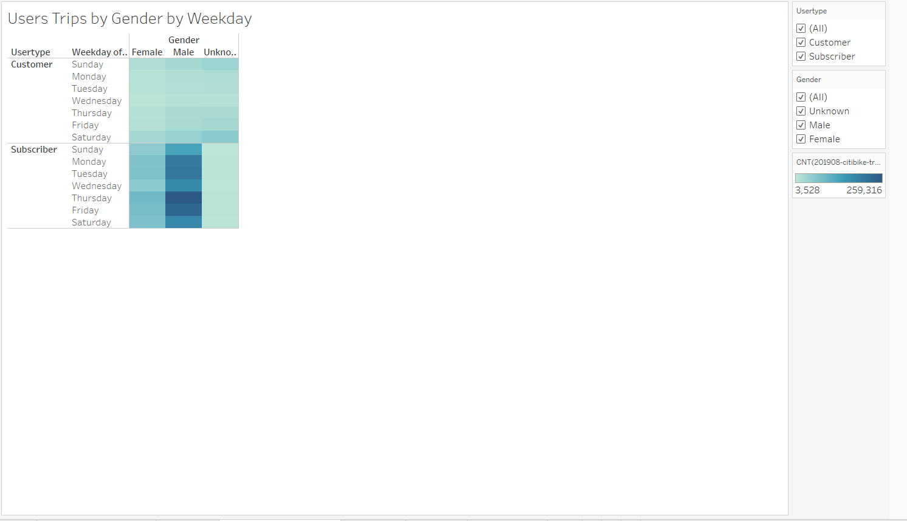
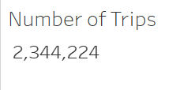
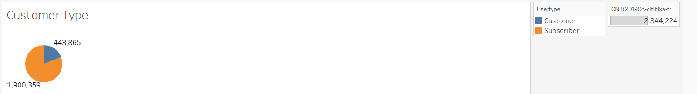

# Bike Sharing Proposal

## Overview

Using data from NYC Citi Bike we were able to analyze data to propose a new bike sharing program in Des Moines. After visualizing the data we hope to be able to create a succesful bike sharing program in Des Moines and possibly be even more succesful

## Results

[Proposal Story](https://public.tableau.com/views/NYCBikeSharingStory/NYCBikeSharing?:language=en-US&:display_count=n&:origin=viz_share_link)

